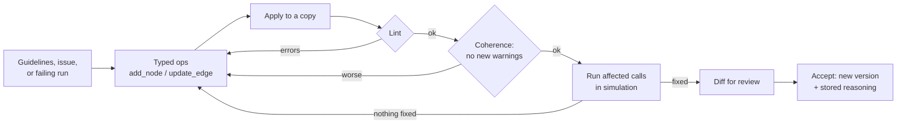

# Solution

A builder for voice agents, and a Copilot that does the two jobs the brief says
your deployment team does by hand.

The idea in one line: **an agent is a typed graph, so the Copilot can be built
like a compiler with a test harness instead of a chatbot that edits JSON.** Every
change arrives as a diff. By the time you see that diff it has already been
applied to a copy, linted, and run against the calls it claims to fix.

Live at **https://212.227.246.190.sslip.io**, answering a real phone number.

## The demo, in the order I'd show it

1. Paste a page of clinic guidelines. A ten-node agent appears on the canvas.
2. Place a browser call. The graph lights up node by node while you talk.
3. Open **Issues**: 12 production calls, mined into 9 ranked failures with quotes.
4. Click **Fix this** on the critical one. The Copilot proposes ops, lints them,
   runs the affected tests, and only then shows a diff.
5. Accept it. New version, revertible, with the reasoning stored.
6. Turn a recorded call into a regression test in one click.

That's about five minutes.

---

## Phase 1 — the builder

The graph is editable on a canvas. Drag nodes (positions are UI-only and stored
per browser, never in the agent), edit a node's instructions and exits, and see
lint feedback as you type. A test call runs in the browser over WebRTC. There's a
text tester too, for when you have no microphone.

Watching the agent take the wrong edge live is a much faster diagnosis than
reading the transcript afterwards. That was worth the canvas work on its own.

Two changes to the starter's agent format, both load-bearing later:

- **`global_edges`** — exits available from every non-terminal node. An emergency
  or "let me talk to a person" can happen at any point in a call. Repeating the
  same edge on twelve nodes is unreadable, and one node always gets missed.
- **`transfer_to` on a node** — an E.164 number. Before this, `transfer_to_staff`
  said *"I'll pass you to a member of the team"* and hung up. It now redirects the
  live call to `<Dial>`.

---

## Phase 2 — the Copilot

### The loop



Two repair attempts, then it shows you what it has and says why it stopped.

### Workflow 1 — guidelines to a working agent

Paste a client's reception guidelines and the Copilot builds the graph. Tested
against a page of dental-clinic SOP: a one-node scaffold became a ten-node agent,
lint clean, that derived identity verification gating appointment details,
unverified callers routed to reception, no price quoting over the phone, and a
final read-back. It put the medical emergency on a **global edge**.

That last one is the part I care about. It's a structural judgement, not a
transcription of the text.

### Workflow 2 — production iteration

The brief says the hard part isn't fixing issues, it's finding them. So most of
the work went here.

**Issue mining** reads transcripts in bulk and clusters them into ranked,
recurring failures. On the 12 seeded calls it returns **9 issues — 2 critical, 4
high, 3 medium** — each with severity, the nodes involved, and verbatim quotes.
The top one is *"cancel and reschedule intents are routed into the booking flow"*,
evidenced by a caller saying **"What? No, I'm cancelling, not booking."**

A cluster of calls is a different object from a pile of anecdotes. You can rank
it, argue with it, and hand it straight to the Copilot, because it carries its own
evidence. "Fix this" sends the quotes along with the request.

**Call → test case replay.** A recorded call becomes a regression test in one
click, persona rebuilt from what the caller actually said. This matters more than
it sounds. Every other persona in the suite was invented by a model, and it shows:
the generator wrote assertions demanding the agent ask for information the caller
had already volunteered, which no correct agent can satisfy. Real callers write
better tests than models do, because they aren't guessing.

**Diagnose failures** hands the Copilot the whole failing run: personas, per
assertion verdicts with the judge's reasoning, annotated transcripts, and the exits
available at every node the call visited, with their required fields.

That last piece is the difference between a symptom and a diagnosis. The caller
refuses their date of birth, the agent tries to hand them to a human,
`transfer_to_staff` requires `date_of_birth`, and the escape hatch is closed for
exactly the callers who need it. Nothing in the transcript says that. You only see
it by putting the transcript next to the tool schemas that were live at the time.

---

## Architecture, and the decisions inside it

**Typed patch operations, not file rewrites.** The Copilot emits `add_node`,
`update_edge`, `delete_global_edge`. Never a whole config. A model-rewritten file
can't be reviewed — everything looks changed, so nothing gets read. Ops give a
readable diff, an `affected` set the canvas can tint, and a unit for "this touched
`greeting`, re-run the tests that route through it."

**Lint is the compiler.** Ops are applied to a copy and linted before anything is
shown. Errors go back with the exact message.

**And it may not leave the graph less coherent than it found it.** Pre-existing
warnings aren't its fault and block nothing; a warning the change *introduced*
does. This came from a deliberately bad prompt — "get rid of all the identity
stuff, it's annoying" — which it answered by deleting the route into
`verify_identity` and leaving the node stranded. Zero lint issues before, one
after. It compiled, it was accepted, and the flow made no sense.

**It runs the calls before you see the diff.** The loop originally asked only
"does this apply and lint?", which lets through a diff that assembles perfectly
and fixes nothing. Now the candidate graph runs the affected calls, and if nothing
moved, the new transcripts go back as evidence.

Which calls run is deliberate: the failing ones, plus up to three passing ones
whose recorded path crosses a touched node. That second set exists because the
Copilot edited `greeting` to fix a cancellation and took new-patient booking down
with it. It had no way to anticipate that. The stored paths make it obvious.

**Three guards**, because a loop optimising for green tests will find ways to be
green:

- Score is `fixed − 2 × broke`. Breaking a working path costs more than fixing one
  gains.
- Retiring a test scores **nothing**.
- "Clean" requires something was actually fixed, not just that nothing is failing.

I got that third one wrong twice. A round that retired every failing case had
nothing left to fail, reported clean, and short-circuited before scoring ran,
which made deletion the fastest route to done. My first fix reopened the same hole
from the other side. The probe that caught both is in `check_copilot_loop.py`.

**Diagnoses must cite evidence.** A root cause from a closed list, plus evidence
that quotes a transcript turn or names a structural signal. Restating the failed
assertion doesn't count. The closed list exists because "the wording isn't clear
enough" is a diagnosis you can reach without reading anything, and it was the
reliable retreat whenever the real cause was structural.

**Structural signals.** Some faults are visible in the turn sequence and invisible
in the words. Two are detected by walking it: a node entered and left in the same
turn (the caller never answers its question), and a caller turn the node had no
exit for (the agent improvises, then takes an unrelated exit off its own
suggestion). Diagnose a *wording* cause for a call flagged with a structural
signal and it gets pushed back once.

I'm not certain these two generalise past the 12 calls I have. They're the two I
could see by hand, and I'd expect a real corpus to show more.

**Decision memory.** Accepted changes are stored with the Copilot's own reasoning
and replayed into later prompts. Reasoning behind a judgement call leaves no trace
in the graph, so without this the next session helpfully undoes it: an escape hatch
that requires nothing looks under-specified, and a test retired as unsatisfiable
looks like missing coverage.

**Versioned and revertible.** Every save writes an immutable version with the ops
that produced it; the demo agent is on v7. Reverting writes the old config forward
as a new version, so undoing a revert is the same operation as making one.

**Models.** `gpt-5.1` for the Copilot, `gpt-4.1` for the judge, `gpt-4.1-mini` for
the simulated caller — the highest-volume role gets the cheapest model.

---

## Determinism, honestly

The graded path — simulated caller and judge — runs at temperature 0 with a pinned
seed. Before that the suite scored 2/5, 2/5, 3/5 on an *unchanged* graph, and a
gate whose result moves on its own can't gate anything.

It isn't true determinism. OpenAI's `seed` is best-effort, and `gpt-5.1` doesn't
accept a temperature at all, so the Copilot itself isn't pinned. What I can say is
that repeated runs on an unchanged graph now hold steady, which is what the gate
needs. It trades away some coverage of genuinely borderline behaviour, and I'd
rather hunt flakiness deliberately than trip over it every run.

---

## Results

- **12 mock calls → 9 ranked issues** (2 critical, 4 high, 3 medium), each with
  quotes and affected nodes. No human triage in between.
- **Suite of 6 cases runs in 22.8s.** The stored run sits at 4/6; the two failures
  are what the Copilot loop is pointed at in the demo.
- **Guidelines → 10 nodes, lint clean**, in one pass.
- **Demo agent at v7**, every version revertible, each carrying its ops.

---

## Mocked, real, and left out

**Mocked:** the 12 seed transcripts, as the brief allows. Realistic failures — a
caller on the wrong day, one who can't take any slot, one who wants a human.

**Real:** everything else. WebRTC and PSTN through Twilio, ElevenLabs STT/TTS,
OpenAI, Supabase Postgres, OAuth. The calls in the history actually happened.

**Deliberately not built:**

- **Multi-language.** The miner surfaced it as issue #9 against a Spanish clinic.
  Real gap, large one, and it would have been breadth at the cost of the Copilot.
- **Retention and redaction.** Transcripts hold names, DOBs, reasons for visit. A
  real deployment needs a policy before any of that reaches a prompt. Named, not
  done — it's a compliance workstream.
- **Google verification.** OAuth app is in testing mode; sensitive scopes take
  weeks to review and the flow is identical either way.
- **Operational monitoring.** No dashboard, no alerting. I think this is the
  biggest gap for something answering a real line, and I'd build it first.

**Built but not finished — the calendar.** Provider interface, Google adapter,
OAuth with encrypted tokens, and an in-memory fake, all covered by 23 checks. But
nothing in the graph uses it yet; `offer_times` still reads four slots from a
prompt. Remaining: `Edge.effect` for booking, `pre_actions` for availability,
calendar fixtures so a case can say "these slots are busy". The fake isn't a
convenience — a suite that books into a real diary is worse than no suite.

---

## Scoping

The brief says 8–12 hours and that knowing what not to build is a signal. This went
past that. The core (builder, Copilot, mining, harness, replay) is the challenge.
Multi-tenancy, phone OTP auth, SMS rate limiting, the deployment and Twilio
provisioning came later, when this turned into something being put in front of real
callers. I'd cut most of that from a submission judged purely on scope.

Starting again with the brief alone: the Copilot loop, the miner, the replay, and
just enough builder to show them. Then stop.

---

## Four things that broke

**A silent call that looked healthy.** Every trace fine, caller heard nothing.
ElevenLabs' free tier silently refuses library voices. Found by measuring audio
energy on the wire instead of trusting metrics. There's a preflight probe now.

**A rate limiter that never limited.** `interval '%s seconds'` puts the
placeholder inside a SQL string literal, so whether it binds depends on the driver.
No error, no row, `False` forever. Only visible against the live database.

**History that lied.** `store.save()` read the next version number separately from
writing it. A concurrent write plus a re-run migration gave a v8 pointer and a v8
history row holding different graphs. Version numbers are now allocated inside the
transaction under a row lock, proved by four concurrent saves in `check_store.py`.

**A transfer that hung up.** Pipecat's Twilio serializer ends the call when the
pipeline ends, and transferring works by replacing the TwiML, which ends the
pipeline. It killed the transferred call 34ms after a successful handover. Adding
the auth token is what switched the behaviour on, so fixing signature validation
broke transfers in the same move.

---

## Running it

```bash
make install && make seed && make build && make run   # http://localhost:7860
```

Needs `OPENAI_API_KEY` and `ELEVENLABS_API_KEY` in `backend/.env`. Everything else
is optional: `STORE_BACKEND=files` runs the whole thing against a local directory,
`AUTH_DISABLED=1` skips sign-in.

No unit-test framework. There are executable checks that exercise real behaviour
and print what they verified.

| | |
|---|---|
| `check_copilot_loop.py` | verify loop, scoring, reward-hacking guards, coherence, decision memory — model stubbed, so it's free |
| `check_tenancy.py` | two accounts can't see each other's agents, calls, tests or issues |
| `check_store.py` | version history under four concurrent writes |
| `check_calendar.py` | slot arithmetic, double-booking, idempotency, timezones |
| `check_twilio.py` | media-stream endpoint with real 8kHz μ-law, no phone number needed |
| `frontend/check-*.mjs` | the UI in real Chrome — editing, diagnosis, replay, sign-in, activation |

Start with `check_copilot_loop.py`, where the Copilot's judgement is pinned down,
and `check_tenancy.py`, whose failure would show one clinic another clinic's
patients.

---

## Where I'd go next

1. **Operational awareness.** Calls, outcomes, latency, errors, and a nightly mine
   that reports what's new. The loop has no motor right now — every step needs a
   human to press a button.
2. **Better agent creation from a weak prompt.** A thin prompt produces a graph
   that lints clean and is quietly wrong: missing intents, no escape hatch, no
   emergency edge. Iteration has guards; creation has none, which is backwards,
   since the first draft is what every later round builds on. Fix: a coverage check
   against what a scheduling agent must handle, and a Copilot that asks two or
   three questions before generating instead of guessing.
3. **Finish the calendar.** Half paid for already.
4. **A confabulation guard.** The agent once said *"I'll go ahead and cancel your
   previous appointment now"* with no cancel capability anywhere in the graph. We
   know exactly what a graph can do, so an agent claiming more is detectable. It's
   also the failure that most directly harms a caller.
